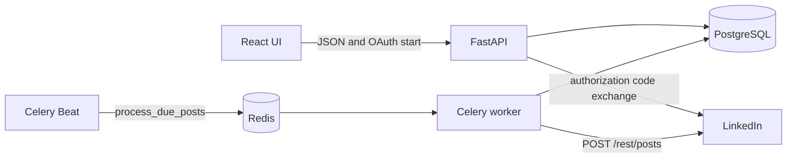
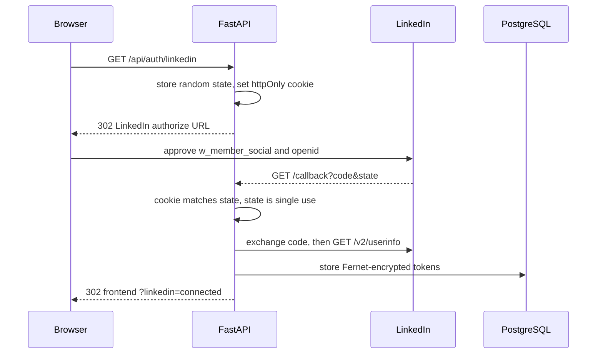
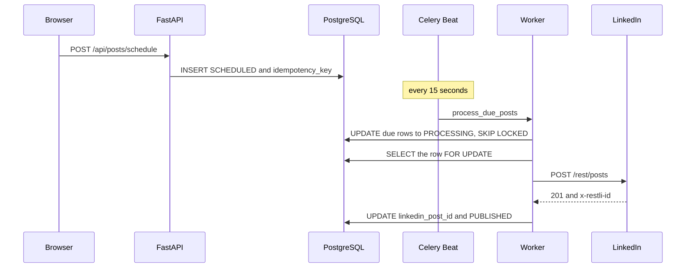
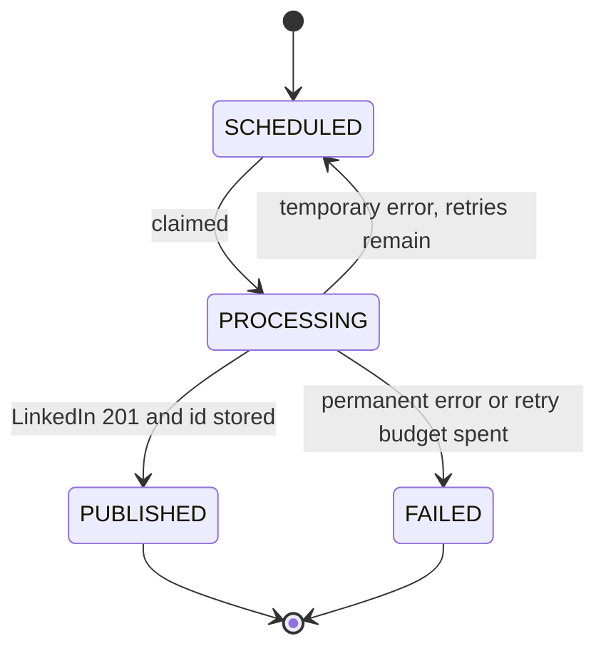
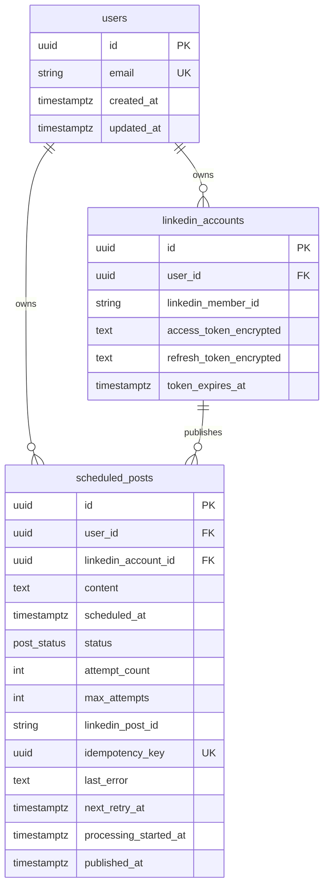

# LinkedIn Post Scheduler — Architecture

The browser schedules nothing. FastAPI writes PostgreSQL. Celery Beat wakes a worker. The worker is the only process that calls the LinkedIn Posts API.

## 1. High-level architecture



| Process | Responsibility |
| --- | --- |
| API | OAuth, schedule, list, health. Does not publish. |
| Beat | Every 15 seconds, enqueue `process_due_posts`. |
| Worker | Claim due rows and publish them. |
| PostgreSQL | Accounts, posts, status, retry time, LinkedIn post id. |
| Redis | Celery broker only. |

OAuth `state` is process memory plus an httpOnly cookie, not Redis.

## 2. OAuth flow



The redirect URI must be exactly `/api/auth/linkedin/callback` on the API origin. Deprecated scopes and `/v2/me` are not used.

## 3. Scheduling flow



`scheduled_at` is compared in UTC. The UI converts the local datetime-local value to an ISO timestamp with a timezone before it sends the request.

## 4. Retry flow

```mermaid
flowchart TD
  claim[Claim SCHEDULED row]
  call[Call LinkedIn]
  ok[PUBLISHED]
  permanent[FAILED immediately]
  wait[SCHEDULED with next_retry_at]
  exhausted[FAILED after the last retry]

  claim --> call
  call -->|201| ok
  call -->|400 401 403 422| permanent
  call -->|429 5xx timeout connection| wait
  wait -->|attempts remain| claim
  wait -->|attempt_count is 5| exhausted
```

`MAX_RETRIES = 4`. The waits are jittered around 5s, 15s, 45s, and 120s. Celery `max_retries` is 0, so a broker redelivery cannot skip the database checks.

## 5. Post state machine



`attempt_count` increases when the row is claimed, before the HTTP call.

## 6. Database ER diagram



`idempotency_key` never changes across retries. `linkedin_post_id` is written only after LinkedIn accepts the post. Tokens are ciphertext. `last_error` is a short code such as `invalid_token` or `rate_limited`.

Indexes: `(status, scheduled_at)`, `linkedin_account_id`, unique `idempotency_key`, and `user_id`. A composite foreign key keeps a post's account and user on the same account row.

## Duplicate-post limitation

The official Posts API documents idempotent **deletion**. `POST /rest/posts` does not document an idempotency key ([Posts API, version 202609](https://learn.microsoft.com/en-us/linkedin/marketing/community-management/shares/posts-api?view=li-lms-2026-09)). The database is the protection.

The LinkedIn call and the database commit are not one transaction. If the worker dies after LinkedIn returns 201 and before `linkedin_post_id` is committed, a later retry can create a second LinkedIn post. The same gap exists for a timeout after LinkedIn has already accepted the request. The worker does not invent a post id it never received.

## Logging

Each event is one JSON object with `event`, `request_id`, `post_id`, `user_id`, `status`, `attempt_count`, and `duration`. A filter removes bearer tokens, `access_token`, `refresh_token`, `client_secret`, authorization `code`, and Fernet ciphertext before the line is written.
